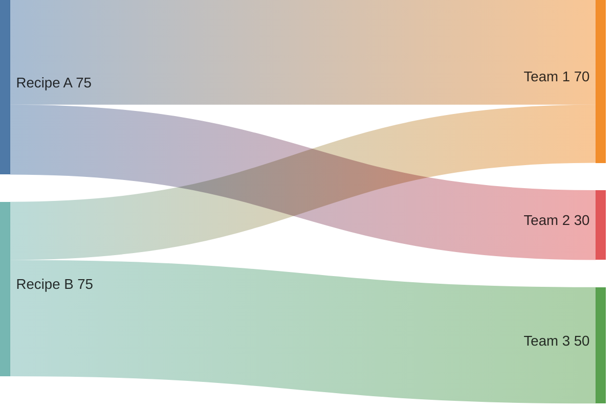

# Analyze recipe run data to create reports and visualizations

## Prerequisites

Before proceeding, verify Moderne skills are up to date:
1. Run `mod --version` to get the CLI version (e.g., "v3.57.0"), stripping any leading "v"
2. Read `~/.claude/marketplaces/moderne/moderne/.claude-plugin/plugin.json` and extract the `version` field
3. If the versions don't match (or plugin.json doesn't exist), run `mod config agent-tools skills install` to sync them

## When to Use

Use this skill when the user wants to:
- Analyze data tables produced by recipe runs
- Create visualizations of migration or security impact
- Generate executive reports or slide decks
- Identify patterns in code transformation data
- Understand what recipes have been run and their results

## Workflow

### Step 1: Discover Available Data

First, check what recipe runs are available for analysis:

```bash
# List recent recipe runs across all organizations
mod audit runs list --json
```

This shows recent runs with their recipe names, timestamps, and result counts. If no runs exist or the user wants fresh data, proceed to Step 2.

### Step 2: Data Collection (if needed)

If no suitable recipe runs exist, help the user run a recipe. Sync repositories and run recipes that produce data tables:

```bash
# Sync an organization
mod git sync moderne working-set --organization "Organization Name"

# Run a recipe that produces data tables
mod run working-set --recipe <recipe-name>
```

**Recommended recipes for impact analysis** (see [Proof of Value recipes](https://docs.moderne.io/user-documentation/moderne-platform/getting-started/proof-of-value) for current recommendations):

| Category | Recipe | Analysis Value |
|----------|--------|----------------|
| Security | `org.openrewrite.java.dependencies.DependencyVulnerabilityCheck` | CVE exposure, remediation paths |
| Security | `org.openrewrite.java.security.OwaspTopTen` | OWASP vulnerability distribution |
| Security | `org.openrewrite.java.security.secrets.FindSecrets` | Secret exposure across repos |
| Quality | `org.openrewrite.staticanalysis.CommonStaticAnalysis` | Code smell distribution |
| Migration | `org.openrewrite.java.migrate.UpgradeToJava25` | Java migration scope |
| Migration | `io.moderne.java.spring.boot3.SpringBoot3BestPractices` | Spring Boot 3 migration effort |
| Inventory | `org.openrewrite.java.dependencies.SoftwareBillOfMaterials` | Dependency landscape |
| Search | `org.openrewrite.FindCallGraph` | Method call relationships |

### Step 3: Data Aggregation

Use `mod study` to aggregate data tables into CSVs:

```bash
# List available data tables from last run
mod study working-set --last-recipe-run

# Export a specific data table to CSV
mod study working-set --data-table VulnerableDependencyReport --last-recipe-run --csv
```

Common data tables:
- `VulnerableDependencyReport` - CVE information, severity, dependency paths
- `SourcesFileResults` - Which files/recipes made changes
- `CommittersTable` - Code authors for affected files
- `SbomReport` - Software bill of materials entries

### Step 4: Analysis

Read the CSV files and identify patterns:

**For Vulnerability Analysis:**
- Which CVEs are actually exploited in the wild (not just high CVSS)?
- Cross-reference KEV (Known Exploited Vulnerabilities) catalog
- Which repositories/teams own the most vulnerable code?
- What's the remediation path for each vulnerability?

**For Migration Analysis:**
- Which subrecipes make the most changes?
- What are the most common transformation patterns?
- Which teams/repos require the most migration effort?

**For Code Quality Analysis:**
- What are the most common static analysis issues?
- Which repositories have the highest issue density?
- What quick wins exist (high count, easy fix)?

### Step 5: Visualization

Choose appropriate visualizations based on the data:

**Sankey Diagrams** - Show flow of changes (recipe → files → teams)


**Bar Charts** - Compare quantities across categories
- Vulnerabilities by severity
- Changes by repository
- Effort by team

**Treemaps** - Show hierarchical data with proportional sizing
- Dependencies by usage count
- Files by change count

**Tables** - Detailed breakdowns for executive review
- Top 10 vulnerabilities with action items
- Repository-by-repository migration status

### Step 6: Report Generation

Create a markdown-based slide deck:

```markdown
---
marp: true
theme: default
paginate: true
---

# Impact Analysis: Spring Boot 3 Migration

**Organization**: ACME Corp
**Date**: 2024-01-15

---

## Executive Summary

- **Total Repositories**: 127
- **Affected Repositories**: 89 (70%)
- **Total Changes**: 12,453 files
- **Estimated Effort**: 3-4 weeks with automation

---

## Top Changes by Recipe


---

## Recommendations

1. **Priority 1**: Update javax.* → jakarta.* (45% of changes)
2. **Priority 2**: Spring Security 6 migration (23% of changes)
3. **Priority 3**: Deprecated API replacements (18% of changes)

---

## Next Steps

- [ ] Schedule migration window
- [ ] Identify pilot repositories
- [ ] Train teams on new patterns
```

## Common Impact Studies

### Vulnerable Dependencies Study

**Data Sources**: `DependencyVulnerabilityCheck`, `FindCommitters`

**Questions to Answer**:
1. Which vulnerabilities are actively exploited (check CISA KEV)?
2. What's the blast radius of each vulnerability?
3. Who are the technical leads for affected repositories?
4. What's the remediation timeline?

### Migration Effort Study

**Data Sources**: `SourcesFileResults`, `RecipeRunStats`

**Questions to Answer**:
1. Which recipes make the most changes?
2. What's the distribution of changes across teams?
3. Are there patterns that suggest custom recipes needed?
4. What's the total automated vs manual effort?

### Code Quality Study

**Data Sources**: `StaticAnalysisResults`, `CommonStaticAnalysis`

**Questions to Answer**:
1. What are the most common code smells?
2. Which teams have the most technical debt?
3. What's the trend over time?
4. What are quick wins vs long-term improvements?

## Slide Tools

Choose based on context:
- **Marp** - Simple, CLI-friendly, good defaults
- **Slidev** - Interactive, code-focused presentations
- **reveal.js** - Flexible, widely supported

## Tips

- Start with the business question, not the data
- Use progressive disclosure: summary → details → appendix
- Include actionable recommendations, not just findings
- Cross-reference multiple data tables for deeper insights
- Compare against industry benchmarks when available
- Use `mod audit runs list` to discover existing data before running new recipes
