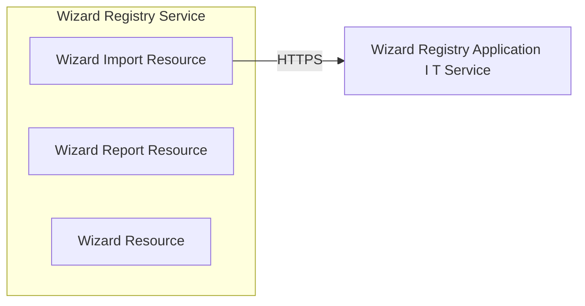

# Architecture

## System Diagram

## Components

### Services

- **WizardImportResource**: POST /api/wizards/import
- **WizardReportResource**: GET /api/reports/{filename}
- **WizardResource**: POST /api/wizards, GET /api/wizards/{id}, GET /api/wizards, +3 more

### External Services

- **Wizard Registry Application I T Service**: HTTPS service

## Reference

For the complete CALM (Common Architecture Language Model) schema, see [calm-architecture.json](calm-architecture.json).
